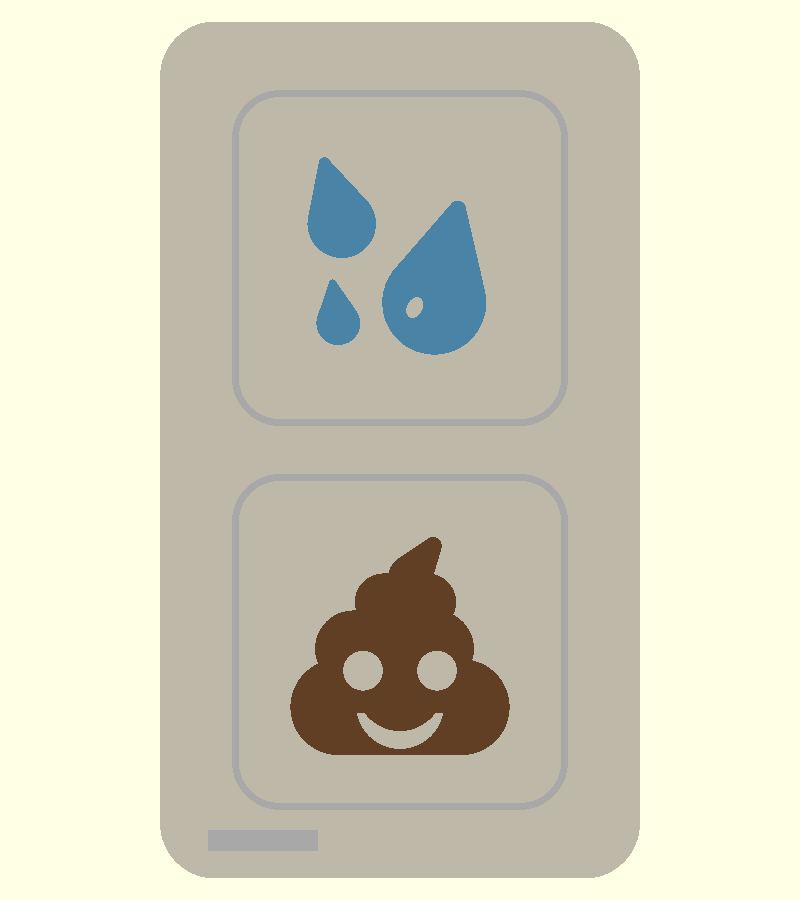
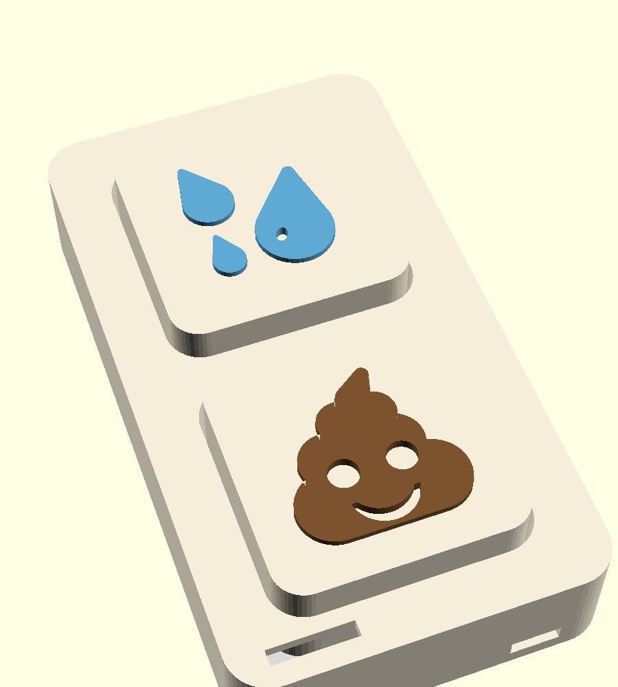

# Biru Buttons · switch plate (design 03)

Two big square caps on a wall plate beside the door — 💦 for pee, 💩 for
poop. Every part prints flat-side-down with **zero supports**, and the emoji
are real 3D geometry (no fonts): they print as separate colour inlays that
stand 1 mm proud of the cap face.

 

Plate 70 × 125 × 22 mm, caps 47 mm square standing 6 mm proud, one MX-style
switch under each cap. `../../designs/two-button/03-switch-plate.png` is the
concept sheet this follows.

## Parts

| STL | qty | print | notes |
|---|---|---|---|
| `face.stl` | 1 | face down | front shell: cap wells with 12 mm guide tubes, 4 × M3 heat-set bosses, LED slot, USB-C notch |
| `back.stl` | 1 | flat | back plate: two 15 mm switch towers, ESP32-C3 rail, 2 keyholes, 4 countersunk M3 |
| `cap-sweat.stl`, `cap-poop.stl` | 1 each | face down | cap with a 1 mm recess in the shape of the emoji |
| `inlay-sweat-0/1/2.stl` | 1 each | face down | the three 💦 drops (blue) |
| `inlay-poop.stl` | 1 | face down | 💩 (brown); eyes and smile are through-holes so the cap colour shows |
| `cap-*-onepiece.stl` | — | needs MMU / supports | cap + raised emoji in one body, for multi-material printers only |

Glue the inlays into the recess (a dab of CA). Suggested colours: caps in
cream or white, drops in blue, poop in brown — the eyes/smile then come out
cream automatically.

## How it goes together

```
wall ─ back plate (keyholes / command strips)
       └ towers: switch clips into a 14 mm cut on top, wires out the side slots
       └ ESP32-C3 SuperMini sits in the rail, USB-C out the bottom of the shell
     front shell screws onto the back plate from behind (M3 × 6 into inserts)
     caps drop onto the switch stems from the front; the skirt rides in the guide tube
```

Cap height is derived, not guessed: `tower_h` in `config.scad` is solved so
the cap face rests `cap_proud` off the front with `stem_top = 6.6` mm of MX
stem above the plate. Change any of those and the tower follows.

## Print settings

0.2 mm layers, 3 walls, 20 % infill, PETG or PLA. Face and caps get the bed
finish on the visible side — a textured PEI sheet looks great here. Inlays
are small; print all four together with a brim.

## Test-fit first (the three tolerances that matter)

1. **Stem cross** — `cross_t = 1.35` (1.27 nominal + slack). Print one cap,
   press it on a switch: too loose → 1.30, cracks the boss → 1.40.
2. **Cap in well** — `well_clear = 1.0` per side. Sticky → 1.2. Rattly → 0.8.
3. **Inlay in recess** — `inlay_clear = 0.12`. Won't seat → 0.2.

Also check the MX cut (`mx_cut = 14.0`) clips firmly on your switches.

## Files

`config.scad` (every dimension) · `emoji.scad` (the 2D 💦/💩 outlines) ·
`cap.scad` (`kind`, `part`, `piece` params) · `face.scad` · `back.scad` ·
`assembly.scad` (preview only) · `render.sh` (needs `openscad` on PATH — on
macOS `brew install --cask openscad@snapshot`, the stable cask is
Gatekeeper-blocked).
